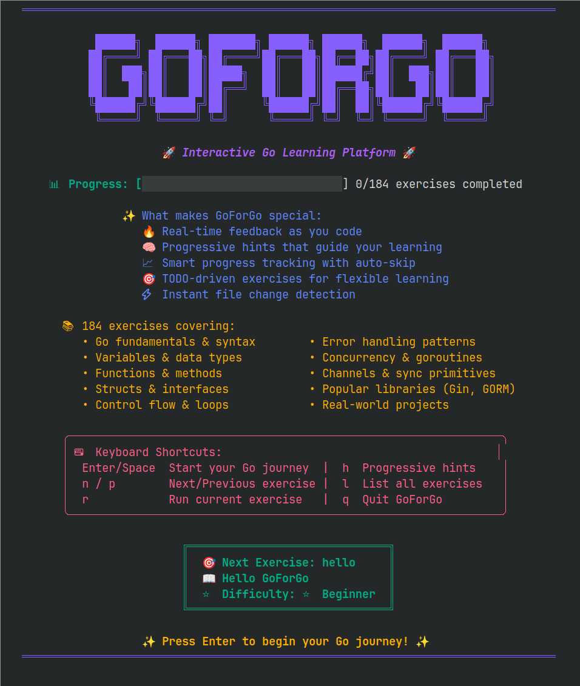
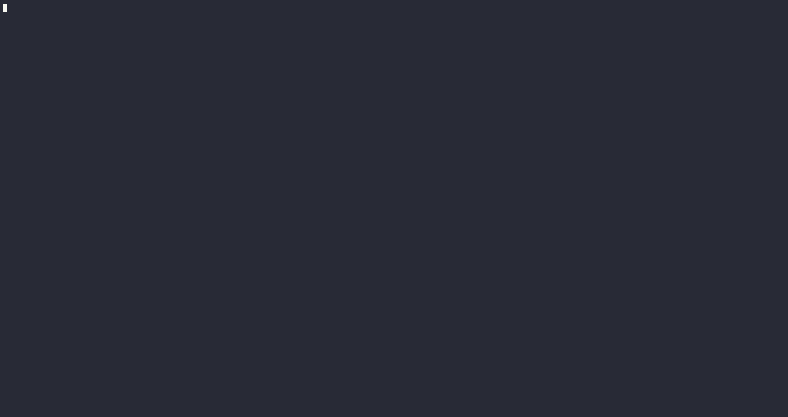

# GoForGo 🚀

[](https://golang.org/dl/)
[](https://opensource.org/licenses/MIT)
[](#building-from-source)

**Interactive Go tutorial CLI inspired by Rustlings** 📚



GoForGo helps you learn Go by fixing broken code exercises with real-time feedback. It features **182+ exercises** covering Go fundamentals through advanced real-world topics including **Kubernetes, big data, DevOps integration**, and comprehensive **third-party library ecosystem**, all with a beautiful terminal interface.

## 🎬 Demo



_Experience GoForGo's elegant interface: animated splash screen, comprehensive welcome screen, real-time file watching, progressive hints, and smart progress tracking with uniform styling across all pages._

## ✨ Features

- 🎯 **182+ Interactive Exercises** - From basics to advanced real-world Go development
- 👁️ **Real-time File Watching** - Automatic compilation and feedback as you code
- 🎨 **Beautiful TUI** - Clean terminal interface with progress tracking
- 📚 **Progressive Learning** - Structured curriculum with difficulty levels
- 💡 **Smart Hints** - Context-aware hints that adapt to your attempts
- 🧪 **Advanced Testing** - Universal validation system with container integration
- 🔧 **Modern Go** - Latest Go 1.24+ features and best practices
- 📦 **Complete Ecosystem** - Third-party libraries, Kubernetes, big data, DevOps tools
- ☸️ **Kubernetes Mastery** - client-go, CRDs, controllers, operators
- 🚀 **Big Data & DevOps** - Kafka, Hadoop, Spark, Elasticsearch integration

## 🚀 Quick Start

### Option 1: Install from Source (Recommended for now)

```bash
# Clone the repository
git clone https://github.com/stonecharioteer/goforgo.git
cd goforgo

# Build and install
just build  # or: go build -o bin/goforgo ./cmd/goforgo

# Initialize exercises in your learning directory
mkdir ~/learn-go && cd ~/learn-go
~/path/to/goforgo/bin/goforgo init

# Start learning!
~/path/to/goforgo/bin/goforgo
```

### Option 2: Direct Go Install (Coming Soon)

```bash
go install github.com/stonecharioteer/goforgo/cmd/goforgo@latest
```

## 🎮 Usage

### Initialize Your Learning Environment

```bash
goforgo init
```

This creates:

- `exercises/` - 182+ Go exercises organized by topic
- `solutions/` - Complete reference solutions
- `.goforgo.toml` - Your progress and preferences

### Start Interactive Mode (Default)

```bash
goforgo
```

This launches the interactive mode with:

- ⚡ Real-time file watching and compilation
- 📊 Progress tracking and visual feedback
- ⌨️ Keyboard shortcuts for navigation
- 💡 Progressive hints and guidance

### Run Specific Exercises

```bash
goforgo run hello              # Run the 'hello' exercise
goforgo run                    # Run next incomplete exercise
goforgo hint variables1        # Show hint for specific exercise
goforgo list                   # List all exercises with progress
goforgo list --all             # Show completed exercises too
```

### Available Commands

| Command                                 | Description                               |
| --------------------------------------- | ----------------------------------------- |
| `goforgo`                               | Start interactive watch mode (default)    |
| `goforgo init`                          | Initialize exercises in current directory |
| `goforgo run [exercise]`                | Run specific exercise or next incomplete  |
| `goforgo hint [exercise]`               | Show progressive hints                    |
| `goforgo list [--all] [--category=...]` | List exercises with filters               |
| `goforgo watch`                         | Explicit watch mode with file monitoring  |

## 🏗️ Building from Source

### Prerequisites

- **Go 1.24+** (required for latest language features)
- **Just** (recommended) - Install from [casey/just](https://github.com/casey/just)
- **Git** for version information

### Development Setup

```bash
# Clone repository
git clone https://github.com/stonecharioteer/goforgo.git
cd goforgo

# Install development dependencies
just install-deps

# Build for development
just dev-build

# Run tests
just test

# Build optimized release binary
just build
```

### Available Just Commands

```bash
just --list                    # Show all available commands

# Building
just build                     # Build optimized binary
just dev-build                 # Fast development build
just build-race                # Build with race detection
just build-release             # Cross-platform release binaries

# Testing & Quality
just test                      # Run all tests
just test-coverage             # Generate coverage report
just bench                     # Run benchmarks
just lint                      # Lint code with golangci-lint
just fmt                       # Format code

# Development
just dev-run                   # Build and test CLI in demo mode
just test-cli                  # Test CLI functionality
just watch                     # Auto-rebuild on changes (requires entr)
just pre-commit                # Full check before committing

# Maintenance
just clean                     # Clean build artifacts
just tidy                      # Tidy Go modules
just info                      # Show project information
```

### Manual Build (without Just)

```bash
# Basic build
mkdir -p bin
go build -o bin/goforgo ./cmd/goforgo

# With version information
go build -ldflags="-X 'github.com/stonecharioteer/goforgo/internal/cli.version=v1.0.0'" -o bin/goforgo ./cmd/goforgo

# Cross-platform builds
GOOS=linux GOARCH=amd64 go build -o dist/goforgo-linux-amd64 ./cmd/goforgo
GOOS=darwin GOARCH=amd64 go build -o dist/goforgo-darwin-amd64 ./cmd/goforgo
GOOS=windows GOARCH=amd64 go build -o dist/goforgo-windows-amd64.exe ./cmd/goforgo
```

## 📚 Exercise Categories

GoForGo includes **182 exercises across 46 categories**:

### Core Go Fundamentals (76 exercises)

- **01_basics** - Hello world, syntax, comments, program structure (10 exercises)
- **02_variables** - Types, declarations, zero values, constants (9 exercises)
- **03_functions** - Parameters, returns, methods, closures (12 exercises)
- **04_control_flow** - if/else, loops, switch, defer, panic/recover (10 exercises)
- **05_arrays** - Fixed-size collections, iteration, sorting (5 exercises)
- **06_slices** - Dynamic arrays, capacity, tricks (6 exercises)
- **07_maps** - Key-value structures, patterns, performance (5 exercises)
- **08_structs** - Custom types, embedding, methods (4 exercises)
- **09_interfaces** - Type satisfaction, composition, assertions (4 exercises)
- **10_errors** - Error handling patterns, wrapping, custom errors (3 exercises)
- **11_concurrency** - Goroutines, channels, context patterns (5 exercises)
- **12_generics** - Type parameters, constraints, inference (3 exercises)

### Advanced Go Features (68 exercises)

- **13_testing** - Units, benchmarks, test doubles, fuzzing (5 exercises)
- **14_stdlib** - Standard library utilities, time, strings, regex (3 exercises)
- **15_json** - Encoding, decoding, streaming, validation (3 exercises)
- **16_http** - Servers, clients, middleware patterns (3 exercises)
- **17_files** - I/O operations, permissions, file watching (3 exercises)
- **18_regex** - Pattern matching, parsing, advanced expressions (3 exercises)
- **19_reflection** - Type inspection, dynamic calls, practical applications (3 exercises)
- **20_advanced** - Design patterns, context patterns, pipeline patterns (3 exercises)
- **21_crypto** - Hashing, encryption, digital signatures (3 exercises)
- **22_net** - TCP/UDP servers, HTTP clients, networking (5 exercises)
- **23_encoding** - Base64, JSON processing, data encoding (3 exercises)
- **24_io** - Buffered I/O, interfaces, streaming patterns (3 exercises)
- **25_paths** - File paths, directory operations (3 exercises)
- **26_os** - Environment, process management, signals (3 exercises)
- **27_math** - Geometry, statistics, number theory (3 exercises)
- **28_sorting** - Search algorithms, sorting comparison (3 exercises)
- **29_data_structures** - Linked lists, stacks, queues, trees (3 exercises)
- **30_algorithms** - Dynamic programming, graph algorithms, pattern matching (3 exercises)
- **31_web** - Web servers, middleware patterns, WebSocket (3 exercises)

### Real-World Patterns (9 exercises)

- **32_microservices** - Service discovery, circuit breakers, distributed tracing (3 exercises)
- **33_databases** - SQL operations, connection pooling, NoSQL (3 exercises)
- **34_grpc** - Service implementation, streaming, interceptors (3 exercises)

### Third-Party Library Ecosystem (38 exercises) ✨ NEW

#### Popular Go Libraries (12 exercises)
- **35_gorilla_mux** - HTTP routing, middleware, advanced patterns (3 exercises)
- **36_cobra_cli** - CLI applications, commands, flags, subcommands (3 exercises)
- **37_bubbletea_tui** - Terminal UI, Model-View-Update, interactive forms (3 exercises)
- **38_advanced_concurrency** - golang.org/x/sync primitives, patterns, debugging (3 exercises)

#### Database & Web Frameworks (9 exercises)
- **39_gorm_database** - ORM patterns, associations, migrations (3 exercises)
- **40_gin_web** - Web framework, routing, middleware, JSON binding (3 exercises)
- **41_logrus_logging** - Structured logging, levels, custom formatters (3 exercises)

#### DevOps & Orchestration (14 exercises)
- **42_kafka** - Message production, consumer groups, stream processing (3 exercises)
- **43_kubernetes** - client-go, CRDs, controllers, operators, automation (5 exercises)
- **44_hadoop** - HDFS operations, MapReduce patterns, YARN (3 exercises)

#### Big Data & Analytics (6 exercises)
- **45_spark** - DataFrames, streaming, distributed computing (3 exercises)
- **46_elasticsearch** - Indexing, searching, aggregations (3 exercises)

## 🎯 Learning Path

1. **🌱 Beginner** (1-76): Core Go fundamentals - syntax, variables, functions, control flow
2. **🌿 Intermediate** (77-144): Advanced features - testing, HTTP, I/O, networking, algorithms
3. **🌳 Advanced** (145-153): Real-world patterns - microservices, databases, gRPC
4. **🚀 Expert** (154-182): Third-party ecosystem - frameworks, Kubernetes, big data, DevOps

Each exercise includes:

- 📝 Clear learning objectives
- ⭐ Difficulty rating (1-5 stars)
- ⏱️ Estimated completion time
- 💡 Progressive hints (3 levels)
- ✅ Automatic validation

## 🤝 Contributing

We welcome contributions! See our [contribution guidelines](CONTRIBUTING.md) for:

- 🐛 **Bug Reports** - Found an issue? Let us know!
- ✨ **Feature Requests** - Ideas for improvements
- 📚 **Exercise Contributions** - Add new exercises
- 🔧 **Code Improvements** - Performance, usability, tests

### Development Workflow

```bash
# 1. Fork and clone
git clone https://github.com/yourusername/goforgo.git
cd goforgo

# 2. Install dependencies
just install-deps

# 3. Make changes and test
just pre-commit

# 4. Submit PR with clear description
```

## 📖 Documentation

- 📋 [**TODO.md**](TODO.md) - Development roadmap and tasks
- 🎯 [**GAMEPLAN.md**](GAMEPLAN.md) - Project architecture and phases
- 🧠 [**CLAUDE.md**](CLAUDE.md) - Development insights and learnings
- 📚 [**docs/**](docs/) - Additional documentation

## 🙏 Acknowledgments

- **Rustlings** - Original inspiration for interactive learning
- **Go Team** - Amazing language and tooling
- **Charm** - Beautiful TUI libraries (Bubble Tea, Lip Gloss)
- **Community** - All the Go learning resources and examples

## 📄 License

MIT License - see [LICENSE](LICENSE) file for details.

---

**Happy Learning! 🎉**

_Start your Go journey today with `goforgo init`_
